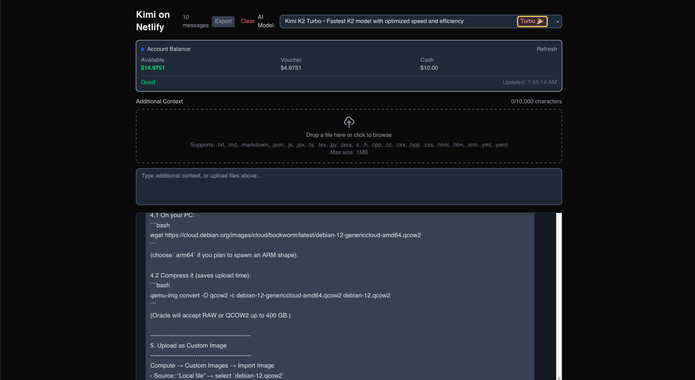

# Kimi Chat Application

[](https://app.netlify.com/projects/kimichatapp/deploys)

A modern, real-time AI chat application built with Next.js 15 and integrated with Kimi AI (Moonshot AI). Features streaming responses, responsive design, and seamless deployment on Netlify.

## Screenshots

### Main Chat Interface

*Real-time streaming responses with copy functionality, token consumption counter and context system*

## Features

### 🤖 **Advanced AI Capabilities**
- **Tool Calling System**: AI can execute code, solve math problems, and analyze data
- **Real-time Streaming**: Word-by-word response generation
- **12 Official Models**: Including latest Kimi K2 family with 1T parameters 🎉

### 💰 **Cost Transparency**
- **Live Token Estimation**: See costs before sending requests
- **Account Balance**: Real-time balance monitoring with auto-refresh
- **Usage Analytics**: Track spending and optimize usage patterns

### 📁 **File Processing**
- **Smart Upload**: Local (1MB) or server-side (100MB) processing
- **Multiple Formats**: Text, code, markdown, PDF, and more
- **Drag & Drop**: Intuitive file handling interface

### 🎨 **Professional UI**
- **Modern Design**: Clean interface with dark mode
- **Responsive**: Works perfectly on all devices
- **Copy & Export**: Save conversations and responses

## Technology Stack

- **Frontend**: Next.js 15.5, React 19, TypeScript 5
- **Styling**: Tailwind CSS v4 with CSS-in-JS
- **AI Integration**: Moonshot AI via OpenAI-compatible SDK v4
- **Tool System**: Custom tool calling with code execution
- **File Processing**: Multi-format support with server upload
- **Streaming**: Vercel AI SDK v3 with real-time responses
- **Cost Tracking**: Token estimation and balance monitoring
- **Deployment**: Netlify with Edge Functions, Docker support
- **Development**: ESLint 9, TypeScript strict mode, Node.js 20

## Project Structure

```
src/
├── app/
│   ├── layout.tsx          # Root layout with global styles
│   ├── page.tsx            # Main chat interface with tool calling
│   ├── globals.css         # Global Tailwind styles
│   └── api/
│       ├── auth/           # Authentication system
│       ├── chat/           # Enhanced chat with tool support
│       ├── balance/        # Account balance checking
│       ├── estimate-tokens/# Token cost estimation
│       ├── upload-file/    # File upload to Moonshot API
│       └── tools/          # Tool execution endpoints
│           ├── calculator/ # Mathematical operations
│           └── code-runner/# Code execution (JS/Python)
├── components/
│   ├── CopyButton.tsx      # Response copy functionality
│   ├── FileUpload.tsx      # Local file processing
│   ├── EnhancedFileUpload.tsx # Dual-mode file handling
│   └── UsageInfo.tsx       # Balance and token display
├── netlify.toml            # Netlify deployment config
├── Dockerfile              # Multi-stage Docker setup
└── package.json           # Dependencies and scripts
```

## Getting Started

### Prerequisites

- Node.js 20 or higher (recommended for Next.js 15)
- npm, yarn, or pnpm
- Kimi AI API key from [Moonshot AI Platform](https://platform.moonshot.cn/)

### Installation

1. Clone the repository:
```bash
git clone https://github.com/helpfiles11/kimichatapp.git
cd kimichatapp
```

2. Install dependencies:
```bash
npm install
```

3. Set up environment variables:
```bash
cp .env.local.example .env.local
```

Add your configuration to `.env.local`:
```
MOONSHOT_API_KEY=your_kimi_api_key_here
AUTH_PASSWORD=your_secure_password_here
```

4. Start the development server:
```bash
npm run dev
```

5. Open [http://localhost:3000](http://localhost:3000) in your browser.

### Docker Setup (Alternative)

Multi-stage Docker setup for both development and production:

**Development:**
```bash
# Build development image
docker build --target development -t kimi-chat-dev .

# Run development container with hot reload
docker run -p 3000:3000 \
  -e MOONSHOT_API_KEY=your_api_key_here \
  -e AUTH_PASSWORD=your_password_here \
  -v $(pwd):/app \
  -v /app/node_modules \
  kimi-chat-dev
```

**Production:**
```bash
# Build production image
docker build --target production -t kimi-chat-prod .

# Run production container
docker run -p 3000:3000 \
  -e MOONSHOT_API_KEY=your_api_key_here \
  -e AUTH_PASSWORD=your_password_here \
  kimi-chat-prod
```

**Features:**
- Node.js 20 Alpine for optimal performance
- Multi-stage builds for smaller production images
- Non-root user for enhanced security
- Hot reload in development mode

## Available Scripts

- `npm run dev` - Start development server
- `npm run build` - Build for production
- `npm run start` - Start production server
- `npm run lint` - Run ESLint

## AI Models (Official from Moonshot API)

**12 Official Models Available** - Directly sourced from `https://api.moonshot.ai/v1/models`:

| Model ID | Name | Badge | Description | Special Features |
|----------|------|-------|-------------|------------------|
| `kimi-latest` | **Kimi Latest** 🌟🎉 | Latest | Always the newest and most advanced Kimi model | Auto-updates to latest |
| `moonshot-v1-auto` | **Auto-Select (Moonshot only)** ⭐ | Smart | Selects best Moonshot model - cannot exceed K2 family | Intelligent routing |
| `kimi-k2-turbo-preview` | **Kimi K2 Turbo** ⚡🎉 | Turbo | Fastest K2 model with optimized speed | Speed optimized |
| `kimi-k2-0905-preview` | **Kimi K2 (Sept 2024)** 🚀🎉 | Enhanced | September 2024 K2 with enhanced performance | Latest K2 features |
| `kimi-thinking-preview` | **Kimi Thinking** 🤔 | Reasoning | Advanced reasoning with step-by-step thinking | Chain-of-thought |
| `moonshot-v1-128k` | **Moonshot V1 (128K)** 📚 | Large Context | 128K token context for long documents | Extended context |
| `moonshot-v1-32k-vision-preview` | **Vision (32K)** 👁️ | Vision | Image understanding + 32K context | Multimodal |
| `moonshot-v1-32k` | **Moonshot V1 (32K)** 📄 | Extended | 32K token context for conversations | Balanced |
| `moonshot-v1-8k` | **Moonshot V1 (8K)** ⚡ | Fast | 8K context optimized for speed | Fast response |

### 🎯 Additional Models Available via API
- `kimi-k2-0711-preview` - July 2024 K2 preview
- `moonshot-v1-8k-vision-preview` - 8K vision model
- `moonshot-v1-128k-vision-preview` - 128K vision model

### Kimi K2 Capabilities
- **Mixture-of-Experts Architecture**: 1 trillion parameters with 32 billion activated
- **256K Context Length**: Handle extremely long documents and conversations
- **Tool Calling**: Advanced agentic capabilities for autonomous problem-solving
- **Coding Excellence**: State-of-the-art performance in coding benchmarks
- **Frontier Knowledge**: Superior performance in math, reasoning, and complex tasks

**⭐ Recommended**:
- `kimi-latest` - Always gets the newest model automatically
- `moonshot-v1-auto` - Intelligent model selection for your task
- `kimi-k2-turbo-preview` - Fastest performance
- `kimi-thinking-preview` - Complex reasoning tasks

## Deployment

### Netlify (Recommended)

1. Connect your GitHub repository to Netlify
2. Set the build command: `npm run build`
3. Set the publish directory: `.next`
4. Add environment variable `MOONSHOT_API_KEY` in Netlify dashboard
5. Deploy automatically on every commit

### Environment Variables

| Variable | Description | Required |
|----------|-------------|----------|
| `MOONSHOT_API_KEY` | Your Kimi AI API key | Yes |
| `AUTH_PASSWORD` | Password to access the chat interface | Yes |

## Architecture Overview

### Frontend
- **Component Structure**: React functional components with hooks
- **State Management**: Built-in `useChat` hook manages conversation state
- **Real-time Updates**: Streaming responses update UI incrementally
- **Responsive Design**: Mobile-first approach with Tailwind CSS

### Backend
- **API Routes**: Next.js API routes handle chat requests
- **Streaming**: Server-sent events for real-time response delivery
- **Security**: API keys stored securely in environment variables
- **Error Handling**: Comprehensive error handling and logging

### Data Flow
1. User submits message through React form
2. Frontend sends POST request to `/api/chat`
3. API route forwards request to Kimi AI
4. Streaming response flows back to frontend
5. UI updates in real-time as response generates

## Authentication System

The app includes a simple password protection system to prevent unauthorized access to your API tokens:

### How It Works
1. **Password Protection**: Users must enter a password before accessing the chat
2. **Session-based**: Authentication persists until browser session ends
3. **API Protection**: Chat API endpoints require authentication headers
4. **Environment-based**: Password stored securely in environment variables

### Setup for Production
1. Set `AUTH_PASSWORD` in your Netlify environment variables
2. Choose a secure password (recommended: 12+ characters)
3. Share the password only with authorized users
4. The password protects your API usage and prevents abuse

## Security Considerations

- API keys stored in environment variables only
- Password protection prevents unauthorized API usage
- No sensitive data exposed to client-side code
- Comprehensive `.gitignore` prevents credential leaks
- Input validation on both frontend and backend
- CORS handling through Next.js API routes

## Performance Optimizations

- Next.js App Router for optimal performance
- Static asset optimization
- Streaming reduces perceived latency
- Efficient re-rendering with React hooks
- Production build optimization

## Browser Compatibility

- Chrome 100+
- Firefox 100+
- Safari 15+
- Edge 100+

Requires modern browser with support for:
- ES2022 features (for React 19)
- Fetch API and FormData
- Server-sent events (for streaming)
- File API (for drag & drop uploads)

## Contributing

1. Fork the repository
2. Create a feature branch: `git checkout -b feature/amazing-feature`
3. Commit your changes: `git commit -m 'Add amazing feature'`
4. Push to the branch: `git push origin feature/amazing-feature`
5. Open a Pull Request

## License

This project is licensed under the MIT License - see the [LICENSE](LICENSE) file for details.

## Contact

For questions or support, please open an issue on GitHub.

## Acknowledgments

- [Kimi AI](https://kimi.moonshot.cn/) for providing the AI capabilities
- [Vercel AI SDK](https://sdk.vercel.ai/) for streaming functionality
- [Next.js](https://nextjs.org/) for the React framework
- [Tailwind CSS](https://tailwindcss.com/) for styling utilities
